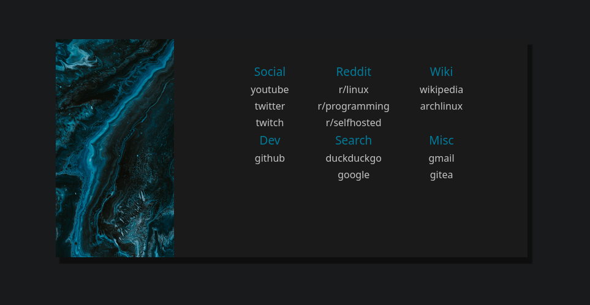

# simple-start

A simple, <b>keyboard or mouse</b> driven, start page for your browser.

Its features include:

- High customizability
  
  - Fully customizable shortcuts
  
  - Includes multiple themes by default
  
  - Easy to theme and change

- Absolutely no dependency on outside resources
  
  - No downloading of 3rd party fonts, frameworks or other stuff

- Keyboard and mouse support
  
  - Using an intuitive keyboard shortcut system means you never have to touch your mouse to interact with the page 

- Configured entirely in the text file
  
  - Loads fast with the options defined in the main.js file

### Theme Galery

                                                                  default-blue

                                                                Solarized Light

                                                               Solarized Dark

## Planned Features

- [ ] Ability to change the theme based on time of day

- [ ] Auto theme generation based on image colors

## Licensing

The code is released under the MIT license.

The included images are under the <a href="https://unsplash.com/license">Unsplash License</a>.

##### Image credits

Skyscraper - <a href="https://unsplash.com/@klim11?utm_source=unsplash&utm_medium=referral&utm_content=creditCopyText">Klim Musalimov</a> 

The rest - <a href="https://unsplash.com/@pawel_czerwinski?utm_source=unsplash&utm_medium=referral&utm_content=creditCopyText">Pawel Czerwinski</a>

## Contributing

Feel free to contribute to the project in any way you'd like. New themes, improvements to the javascript code or new features are welcome!
